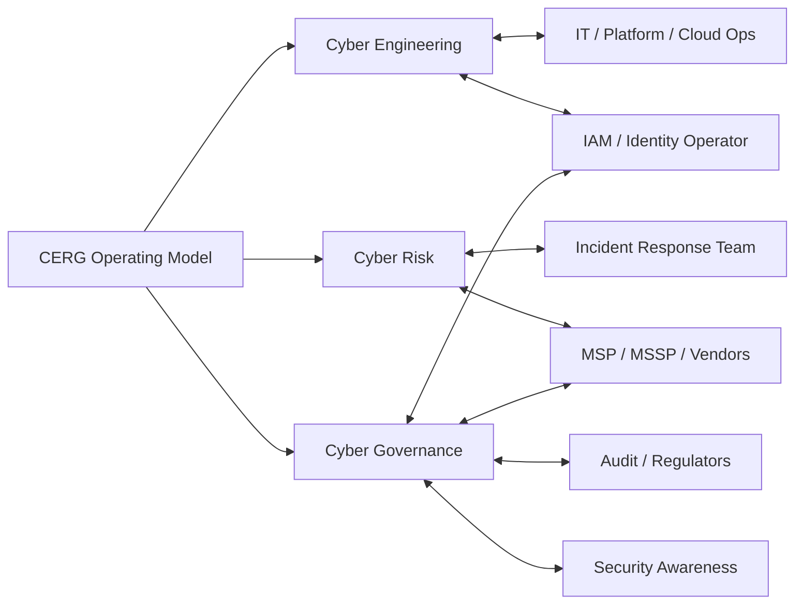
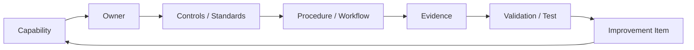

# CISO / CSO Executive Briefing Pack

**Purpose:** help a CISO, CSO, CIO, or security executive understand CERG quickly enough to decide whether it is worth deeper evaluation.

CERG is large by design. Executives do not need the whole corpus first. They need to know what problem it solves, where it fits in the operating model, what it does **not** own, and how it helps with the operational snags already on their desk.

Use this pack as a slide-style briefing, workshop outline, or source material for an actual presentation.

---

## How to Use This Pack

| Situation | Use |
|---|---|
| 5-minute hallway conversation | Use slides 1–3 only. |
| 30-minute CISO briefing | Use slides 1–8. |
| 60-minute executive / leadership workshop | Use the full deck and the snag worksheet. |
| Internal champion trying to get attention | Start with the anti-pattern diagnostic, not the document inventory. |

**Recommended opening:** do not start with “CERG has 100+ documents.” Start with the executive’s current snag.

> “What is one cyber process that keeps coming back to your desk because ownership, evidence, or decision rights are unclear?”

Then map that snag to CERG.

---

# Executive Briefing Deck

The slides below are written in Markdown so they can be copied into PowerPoint, Google Slides, Keynote, Marp, or any other presentation format.

---

## Slide 1 — CERG in One Sentence

**CERG is a cybersecurity operating model that turns scattered security work into accountable capabilities with owners, evidence, decision rights, and improvement loops.**

It is not a tool stack.  
It is not a control framework.  
It is not “security program in a box.”

It answers the executive question:

> “Who owns this, how do we know it is working, and what happens when it is not?”

**Speaker note:** keep this slide short. The hook is not completeness; the hook is executive relief from recurring ambiguity.

---

## Slide 2 — The Executive Problem CERG Solves

Most cyber programs do not fail because nobody cares. They fail because security work is spread across teams that each own a slice, while no one owns the operating chain.

| Recurring executive snag | What is usually missing |
|---|---|
| “Why is this risk still open?” | Treatment owner, decision authority, escalation path. |
| “Did the access review actually happen?” | Evidence quality, population completeness, reviewer accountability. |
| “Can we prove we can restore?” | Test evidence, recovery tiering, dependency validation. |
| “Who is handling the vendor breach?” | Vendor edge inventory, kill-switch, communication path. |
| “Why did security review happen so late?” | Intake trigger, pre-production path, service commitment. |
| “Are we audit-ready?” | Evidence factory, not pre-audit archaeology. |

**CERG organizes the operating chain.**

---

## Slide 3 — The Three-Pillar Lens

CERG uses three accountable pillars to keep work from falling between traditional teams.

| Pillar | Executive shorthand | What it makes visible |
|---|---|---|
| **Cyber Engineering** | Build securely. | Security requirements, architecture decisions, implementation handoff, control design. |
| **Cyber Risk** | Know exposure. | Findings, threat context, treatment options, validation, vendor / edge risk. |
| **Cyber Governance** | Run the system. | Policy, evidence, decision rights, exceptions, compliance, metrics. |

**Key point:** pillars are accountability lenses, not necessarily org-chart boxes. One person, IT team, MSP, or platform group may perform the work; CERG defines what must be owned, evidenced, and governed.

---

## Slide 4 — What CERG Is / Is Not

This slide prevents the most common executive misunderstanding.

| CERG **does** | CERG usually **does not** |
|---|---|
| Define control outcomes and evidence expectations. | Run every technical platform. |
| Establish decision rights and escalation paths. | Own all IT operations. |
| Integrate Engineering, Risk, and Governance work. | Command active incidents. |
| Create reusable audit and compliance evidence. | Own enterprise security awareness operations. |
| Validate whether capabilities operate. | Automatically own IAM, EDR, SIEM, backup, network, cloud, or SaaS administration. |
| Surface unfunded or unclear accountability as risk. | Make resource constraints disappear. |

**Executive translation:** CERG does not grab every security-adjacent function. It makes the security obligations around those functions explicit.

---

## Slide 5 — Operating Boundary Visual

**Readout:** CERG sits across the operating seams. It does not have to own every box to make the seams governed.

---

## Slide 6 — Start With the Snag

Executives are usually not looking for a framework. They are trying to solve a snag.

| If the CISO says... | Start with CERG artifact / concept |
|---|---|
| “Projects reach security too late.” | Architecture Review + Cross-Pillar Flows. |
| “IAM is in IT and audit keeps finding access gaps.” | Access Management Standard + Identity Assurance Package. |
| “We bought tools but still cannot show improvement.” | Capability model + Control Effectiveness Framework. |
| “Vendor risk is all questionnaires.” | Edge Register + TPRM procedure. |
| “Our dashboard is green but I do not believe it.” | Metrics guardrails + anti-pattern catalog. |
| “Evidence is chaos before every audit.” | Evidence Quality Standard + Record Catalog. |
| “Everything becomes a CISO exception.” | Risk Management Framework + approval authority table. |
| “Incident lessons disappear.” | Lessons Learned + Program Improvement Register. |

**Hook:** CERG is easier to sell as a way to fix one recurring snag than as a whole-library adoption.

---

## Slide 7 — Anti-Patterns Executives Recognize Immediately

CERG’s anti-pattern catalog is a good executive entry point because it names familiar failure modes.

| Anti-pattern | Executive symptom |
|---|---|
| **Capability by Tool Purchase** | “We bought it; why is the risk still here?” |
| **Policy-as-Evidence** | “The policy says we do it, but nobody can prove it happened.” |
| **Accountability Without Capacity** | “The RACI names someone who cannot actually make it happen.” |
| **MSSP as Black Box** | “The provider sends reports, but we cannot validate the service.” |
| **Green Dashboard** | “Everything is green until the incident.” |
| **Pre-Audit Archaeology** | “We rebuild evidence every audit cycle.” |
| **Risk Register as Cemetery** | “Risks go in and never come out.” |

**Speaker note:** this slide often gets better engagement than the framework diagram. It starts from pain, not architecture.

---

## Slide 8 — The CERG Capability Pattern

CERG asks every material security capability to show the same chain:

**Executive readout:** if any link is missing, the capability is probably weaker than the status report says.

Examples:

- Access review without population evidence is not a review.
- Backup without restore test is not recovery capability.
- Vendor contract without kill-switch evidence is not vendor resilience.
- SIEM without tested detections is not detection capability.

---

## Slide 9 — “Who Does What?” Without Org-Chart Traps

CISOs and CSOs often jump to “who does what.” CERG answers that, but it avoids assuming every organization is staffed the same way.

| Work | CERG accountability question |
|---|---|
| IAM run by IT | Are cyber requirements, evidence, exceptions, and escalation documented? |
| SIEM run by MSSP | Can we validate log coverage, triage quality, SLA, and tuning? |
| Cloud run by platform team | Are landing zones, IAM, logging, and change paths governed? |
| Backups run by infrastructure | Are restore tests evidenced and tied to criticality? |
| IR run by standing IR team | Does CERG provide asset, identity, evidence, risk, and recovery context? |
| Awareness run by HR / comms | Does Governance align required content and evidence? |

**Message:** CERG does not require a reorg before it creates value. It can start by clarifying accountability across the current operating model.

---

## Slide 10 — Decision Slide: What Executives Must Decide

CERG adoption usually stalls when these decisions are implicit.

| Decision | Why it matters |
|---|---|
| What scope are we adopting first? | Prevents “boil the ocean” adoption. |
| Which capabilities are live, deferred, or inherited? | Makes honest status possible. |
| Who can accept risk at each severity? | Stops exception drift and CISO bottlenecks. |
| Which evidence must exist every quarter? | Creates audit readiness as exhaust. |
| What work is unfunded or under-capacity? | Converts hidden backlog into visible risk. |
| Which seams with IT / IAM / MSP / IR are governed? | Prevents gaps where “not my team” becomes exposure. |

**Close:** CERG is not a document decision. It is an operating decision.

---

## Slide 11 — 30-Day Evaluation Plan

A CISO does not need to adopt everything to learn whether CERG helps.

| Week | Action | Output |
|---|---|---|
| 1 | Pick one painful operating snag. | Named scenario and executive sponsor. |
| 1 | Map current owners, handoffs, decisions, and evidence. | Current-state flow. |
| 2 | Compare against CERG artifact chain. | Gap list: owner, evidence, decision, validation. |
| 3 | Run one evidence retrieval or tabletop test. | Proof of where the model breaks today. |
| 4 | Decide: adopt, adapt, defer, or reject. | Executive decision memo and next-step backlog. |

**Good pilot candidates:** access review, architecture review, vendor incident readiness, exposure treatment, audit evidence retrieval, backup restore proof.

---

## Slide 12 — What Success Looks Like

After CERG starts working, the executive experience changes.

| Before | After |
|---|---|
| “Who owns this?” | Named accountable role and operating owner. |
| “Did this happen?” | Evidence record with scope, timestamp, owner, and control mapping. |
| “Why is this still open?” | Treatment plan, exception, risk acceptance, or escalation. |
| “Are we ready for audit?” | Evidence produced on cadence. |
| “Can we survive this scenario?” | Tested capability with known gaps and owners. |
| “Do we need more people?” | Capacity gap tied to specific capability and risk. |

**Final executive message:** CERG makes cybersecurity manageable by making ownership, evidence, and decisions visible.

---

# Executive Snag Worksheet

Use this worksheet before presenting the full framework.

| Question | Notes |
|---|---|
| What cyber issue keeps returning to the CISO / CSO desk? |  |
| Which teams touch it today? |  |
| Who thinks they own it? |  |
| Who actually has authority to change it? |  |
| What evidence proves it is working? |  |
| What happens when it fails? |  |
| What decision is being avoided? |  |
| Which CERG artifact or concept maps to the snag? |  |

---

# Visual Patterns to Try

Visuals are subjective. These patterns tend to work for executives because they show operating tension rather than document structure.

| Visual | Use When | Avoid When |
|---|---|---|
| **Three-pillar triangle** | Explaining Engineering / Risk / Governance at a glance. | Audience already thinks in org-chart silos. |
| **Operating seams map** | Showing CERG does not need to own IAM / IR / IT to govern the seam. | You need strict RACI detail. |
| **Capability evidence chain** | Challenging optimistic maturity claims. | Audience wants budget numbers only. |
| **Anti-pattern grid** | Creating recognition and urgency. | Culture is defensive; frame as “common failure modes.” |
| **Snag-to-artifact map** | Moving from pain to action. | Audience wants full framework taxonomy. |
| **30-day evaluation plan** | Lowering commitment anxiety. | Adoption decision is already made. |

---

# Suggested Leave-Behind

If the executive only reads one page after the meeting, leave this:

1. CERG is an operating model, not a tool or control framework.
2. It does not require CERG to own IAM, IR, Awareness, IT operations, or vendor operations.
3. It defines the security obligations around those functions: owner, evidence, exception, escalation, validation.
4. It works best when introduced through a painful operating snag.
5. The anti-pattern catalog is the fastest way to recognize why the current model is failing.
6. A 30-day pilot can test value before broad adoption.
